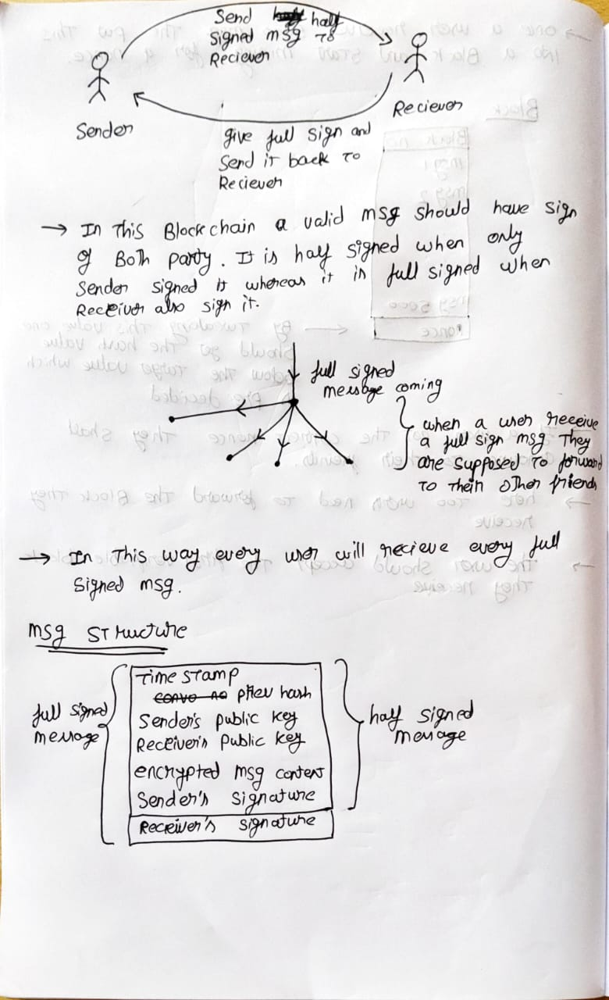
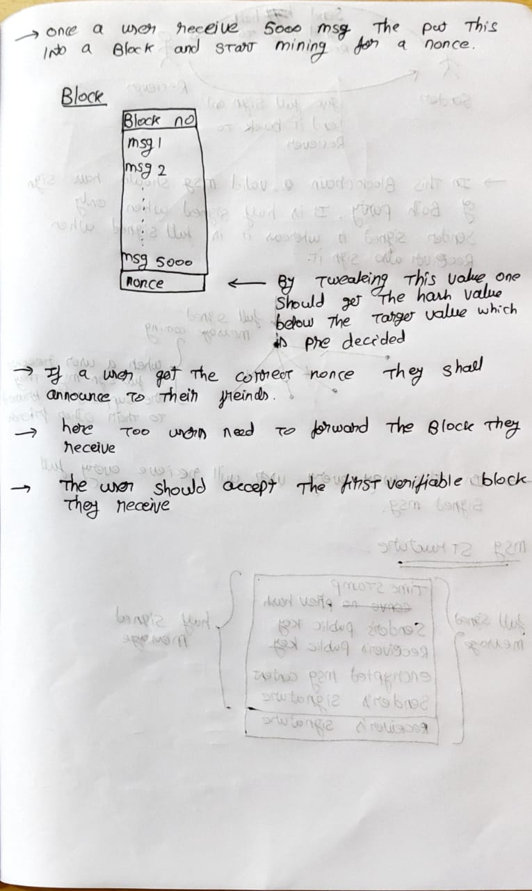

# Blockchain for Private Communication

## Project Overview
This project is an ambitious attempt to build a blockchain from scratch using Python. Our goal was to create a peer-to-peer decentralized system for private communication as there is no third party involvement

## Features
- Implemented core blockchain data structure and block hashing (SHA-256).
- Basic peer-to-peer node communication prototype using Python sockets.
- Demonstrated block validation and chaining logic.
- Presented clear architectural design and conceptual underpinnings.

## Core Algorithm
Below is a handwritten diagram of our working algorithm, covering block creation, SHA-256 hashing, RSA encryption/decryption, and P2P message broadcasting. This forms the backbone of our custom blockchain.

## Demo and Presentation
Due to the complexity involved, the full implementation is incomplete. However, our PowerPoint presentation details our design, challenges, and future plans.

## Challenges Encountered
- Implementing secure and reliable peer-to-peer networking.
- Developing a consensus mechanism from scratch.
- Handling real-world network constraints and synchronization.

## Future Work
- Complete peer discovery and network robustness.
- Implement advanced consensus protocols.
- Integrate smart contract capabilities.

## How to Run
1. Clone this repository.
2. Explore the scripts and documentation to understand the architecture.
3. Currently, no full runnable prototype is available; please refer to our PPT for detailed walkthroughs.

## Team
- Sarvesh VR - 25BCE0980
- Sreya - 25BEC0062
- Keerthi Shree - 25BEC0064
